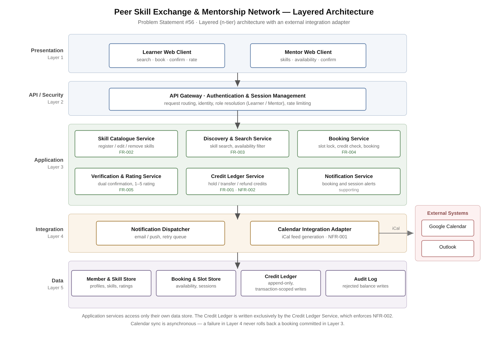

# 2 — Architectural Diagram

| File | Contents |
|---|---|
| [`Architecture_Diagram.svg`](./Architecture_Diagram.svg) / [`.png`](./Architecture_Diagram.png) | Five-layer architecture with the external calendar integration. |
| [`Architecture_Notes.md`](./Architecture_Notes.md) | Why this style was chosen, component responsibilities, three architectural decisions, and how the design handles each exception flow. |

## At a glance

**Style:** Layered (n-tier) — Presentation → API/Security → Application → Integration → Data.

**The two decisions that shaped it:**

1. **One writer for the credit ledger.** NFR-002 requires rejecting 100% of balance changes outside a verified session. That is only enforceable with a single choke point, so the Credit Ledger Service is the sole writer to an append-only ledger.
2. **Calendar sync sits outside the booking transaction.** NFR-001 is a convenience requirement, so a calendar outage degrades the service rather than failing a booking. The slot lock, booking write and credit hold commit as one transaction; publishing to iCal happens asynchronously afterwards.
