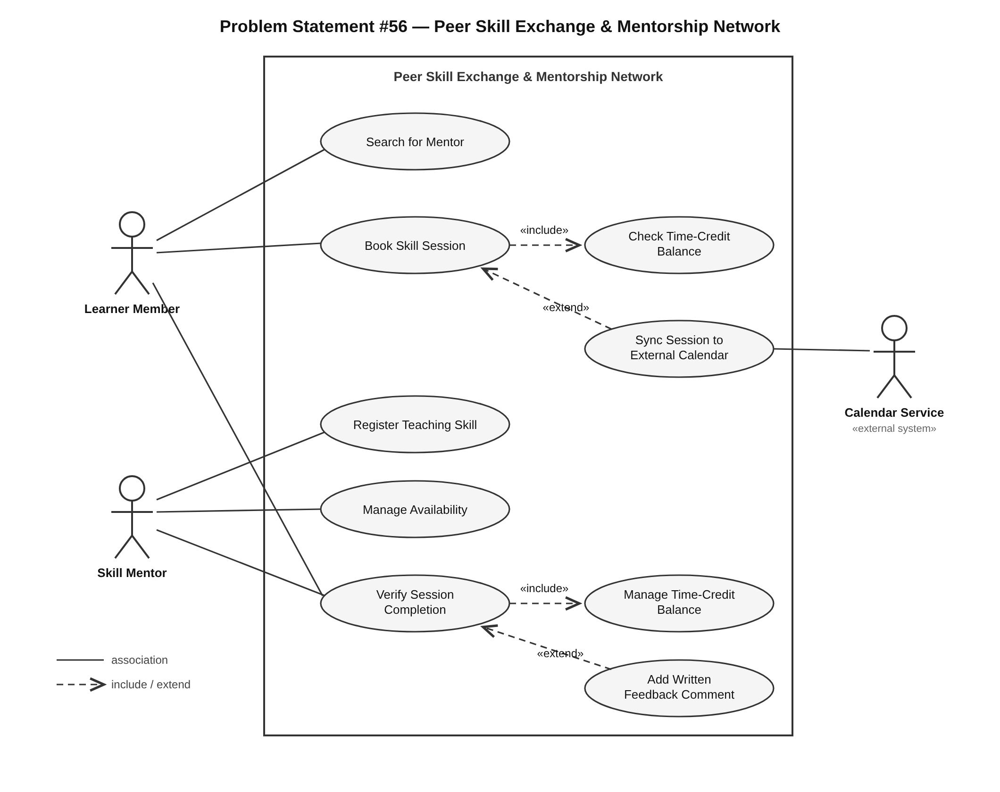

# MyProject_PeerSkillExchange

**Peer Skill Exchange & Mentorship Network** — Software Engineering individual project

**Swara Ashish Potdar** · SRN `PES1UG24CS487` · Section H · Problem Statement **#56**

---

## What this project is

A **time-banking skill exchange platform**. Community members teach each other and settle in *hours*, not money: teach Python for one hour, earn one time credit, spend it on a guitar lesson.

```
Alice knows Python, wants Guitar  ─┐
                                   ├─►  1 hour taught  =  1 time credit earned
Bob knows Guitar, wants Python   ─┘                       1 credit = 1 hour learned
```

The whole platform rests on that single mechanism. A credit must never be created without a verified session behind it, and a session must never be booked without a credit to pay for it — which is why those two conditions drive most of the requirements, the architecture, and every bug raised against it.

**Domain:** Media, Events & Community
**Stakeholders:** Learner Member, Skill Mentor
**Given in the problem statement:** FR-001 (time-credit balance) and NFR-001 (calendar sync via iCal)

---

## Repository structure

| Folder | Contents |
|---|---|
| [`1-RE/`](./1-RE) | Requirements engineering — FRs, NFRs, RTM, use-case diagram, use-case flow, alternate & exception flows |
| [`2-Architectural-Diagram/`](./2-Architectural-Diagram) | System architecture diagram and the reasoning behind the component split |
| [`3-Project-Creation-Screenshots/`](./3-Project-Creation-Screenshots) | Evidence from GitHub and Jira — Kanban, Scrum with two sprints and burndowns, bug tracker |
| [`4-SRS-and-WBS/`](./4-SRS-and-WBS) | Software Requirements Specification and Work Breakdown Structure |
| [`5-Copilot-Generated-Code/`](./5-Copilot-Generated-Code) | GitHub Copilot generated code — screenshots and repository link |
| [`6-Software-Testing-Tools/`](./6-Software-Testing-Tools) | Testing tools practice — find the bug, fix with AI assistance, retest |

---

## Requirements at a glance

| ID | Type | Requirement | Priority |
|---|---|---|---|
| FR-001 | Functional | Maintain a time-credit balance per member, crediting 1 hour on verified session completion | Highest |
| FR-002 | Functional | Allow a member to register, edit and remove teachable skills | High |
| FR-003 | Functional | Allow a learner to search mentors by skill, showing only those with open slots | High |
| FR-004 | Functional | Allow a learner holding ≥1 credit to book an available slot; reject otherwise | Highest |
| FR-005 | Functional | Require both participants to confirm completion and submit a 1–5 rating before verifying | High |
| NFR-001 | Non-functional | Sync the scheduling calendar with Google Calendar and Outlook via iCal feeds | High |
| NFR-002 | Non-functional | Reject 100% of balance modifications not originating from a verified session transaction | High |

Full table with acceptance criteria and rationale: [`1-RE/Requirements_FR_NFR.md`](./1-RE/Requirements_FR_NFR.md)
Traceability through to use cases, Jira stories and tests: [`1-RE/RTM.md`](./1-RE/RTM.md)

---

## Use-case model

**Actors (3):** Learner Member, Skill Mentor, Calendar Service *(external system — justified by NFR-001)*

**Relationships:**

- `Book Skill Session` **«include»** `Check Time-Credit Balance` — every booking checks credits, no exceptions
- `Verify Session Completion` **«include»** `Manage Time-Credit Balance` — every verification settles the credit
- `Add Written Feedback Comment` **«extend»** `Verify Session Completion` — the rating is mandatory, the comment is optional
- `Sync Session to External Calendar` **«extend»** `Book Skill Session` — only if a calendar feed is connected



---

## Project tracking

Three Jira projects were built from these requirements:

| Project | Key | What it demonstrates |
|---|---|---|
| Kanban_BPS#56 | `KBPS56` | 4 Epics → 7 Stories → 23 Sub-tasks on a flow board |
| Scrum_BPS#56 | `SBPS56` | Same backlog, 37 story points, two sprints (21 + 16), both burndowns |
| BugTracker_BPS#56 | `BTBPS56` | 6 defects, each traced to the requirement it breaks |

Both sprints completed their full commitment. Details and screenshots: [`3-Project-Creation-Screenshots/`](./3-Project-Creation-Screenshots)

---

## Related repository

Lab 1 activity submission: [LAB1_Activity_Swara_Potdar_PES1UG24CS487](https://github.com/swarapotd-rgb/LAB1_Activity_Swara_Potdar_PES1UG24CS487)

---

## Document index

| Document | Location |
|---|---|
| Functional & non-functional requirements | [`1-RE/Requirements_FR_NFR.md`](./1-RE/Requirements_FR_NFR.md) |
| Requirements Traceability Matrix | [`1-RE/RTM.md`](./1-RE/RTM.md) |
| Use-case flow — Book Skill Session | [`1-RE/UseCase_Flow_BookSkillSession.md`](./1-RE/UseCase_Flow_BookSkillSession.md) |
| Alternate & exception flows | [`1-RE/Alternate_and_Exception_Flows.md`](./1-RE/Alternate_and_Exception_Flows.md) |
| Architecture notes | [`2-Architectural-Diagram/Architecture_Notes.md`](./2-Architectural-Diagram/Architecture_Notes.md) |
| Software Requirements Specification | [`4-SRS-and-WBS/SRS.md`](./4-SRS-and-WBS/SRS.md) |
| Work Breakdown Structure | [`4-SRS-and-WBS/Work_Breakdown_Structure.md`](./4-SRS-and-WBS/Work_Breakdown_Structure.md) |
